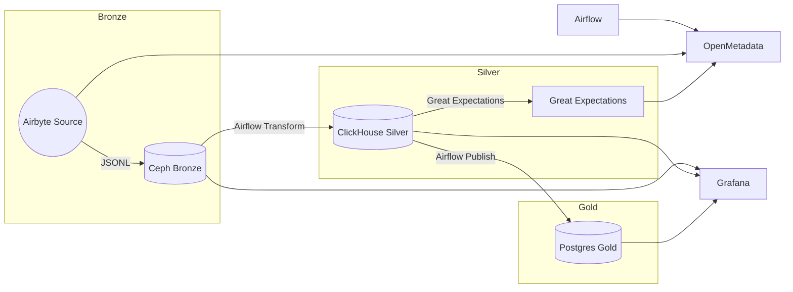

# OneRing Data Platform

Local, Docker-first medallion data platform that showcases orchestration, ingestion, cataloging, quality, versioning, secrets, and observability in a single plug-and-play stack.

## Documentation Map
- `docs/architecture.md` – deep dive into components and flow.
- `docs/concepts.md` – glossary for less-common tools (Ceph RGW, Iceberg REST catalog, Feast, Infisical, etc.).
- `docs/workplan.md` – phased checklist tracking delivery status.

## Stack

| Capability | Tooling |
| --- | --- |
| Orchestration & Batch | Apache Airflow (Celery executor) |
| Ingestion & Streaming | Airbyte (server, worker, webapp, Temporal), Debezium Server (Postgres CDC -> Pulsar), Apache Spark (master/worker), Apache Flink (job/task managers) |
| Messaging & Queues | Apache Pulsar (standalone broker + admin) |
| Table Format & Catalog | Apache Iceberg REST catalog (S3-backed) |
| SQL Query Engine | Trino (Iceberg + Postgres connectors) |
| Object Storage | Ceph RGW (rook-ceph S3 gateway) |
| Warehouses | ClickHouse (analyst-facing Silver/marts), Postgres (transactional/CDC + Airflow metastore) |
| Data Quality | Great Expectations |
| Metadata & Lineage | OpenMetadata (server + ingestion) |
| Schema Versioning | Liquibase (Postgres + ClickHouse changelogs) |
| Feature Store | Feast (file offline store + Redis online store) |
| Experiment Tracking & Registry | MLflow (Postgres backend + Ceph artifact store) |
| Model Serving | Streamlit scoring app backed by MLflow |
| ML Monitoring | Evidently (daily drift reports) |
| Business Intelligence | Metabase (with ClickHouse driver) |
| Demo UI | Streamlit mini-app |
| Identity & Access | Keycloak (IAM & RBAC provider) |
| Directory Services | OpenLDAP (shared LDAP for databases + Keycloak federation) |
| Secrets Handling | Infisical (optional vault) + environment variables |
| Observability | Prometheus + Grafana |

## Prerequisites

- Docker & Docker Compose v2
- GNU Make (optional, for shortcuts)
- Python 3.9+ on the host (`python3 -m pip install -r requirements.txt` installs helper script deps)

## Getting Started

1. Copy the environment template and customize secrets as needed:
   ```bash
   cp .env.example .env
   # edit .env with unique passwords
   ```
2. Install host Python dependencies for helper scripts:
   ```bash
   python3 -m pip install -r requirements.txt
   ```
3. Bootstrap the stack (pull images, seed secrets, run migrations, register resources):
   ```bash
   make bootstrap
   # include extra modules, e.g.:
   # make bootstrap PROFILES="core ingestion"
   ```
   > `bootstrap` orchestrates database/bootstrap migrations, Ceph bucket creation, Airbyte/OpenMetadata registration, and Airflow connection setup. Airbyte can take a couple of minutes to expose its API during the first run.
4. Bring the desired profiles online (defaults to `core`):
   ```bash
   make up
   # examples:
   # make up PROFILES="core ingestion"
   # make up-ingestion        # shortcut == core + ingestion
   ```
5. Validate services:
   ```bash
   docker compose ps
   ```

## Profiles & Modular Startup

The Compose file is partitioned into profiles so you can start only what you need. All `make` targets accept a space-separated list via `PROFILES="..."`, or use the shortcuts (`make up-ingestion`, `make up-ml`, etc.) to bring common combinations online. Profiles are additive—combine them to compose larger scenarios.

| Profile | Key services | Purpose |
| --- | --- | --- |
| `core` | Airflow scheduler/webserver/worker/triggerer/flower, Postgres (metastore & gold), Redis, ClickHouse, Ceph RGW, Infisical | Baseline medallion pipelines, secrets, storage |
| `ingestion` | Airbyte server/worker/webapp + Temporal, ClickHouse ingest helpers, Spark master/worker, Flink job/task managers | Self-service ingestion (Airbyte), core-engineered vendor feeds (Spark), and the primary streaming surface (Flink) |
| `streaming` | Apache Pulsar standalone broker & admin API | Event bus, pub/sub, streaming ingestion |
| `catalog` | OpenMetadata server, Postgres, Elasticsearch, ingestion container | Metadata, lineage, glossary demos |
| `analytics` | ClickHouse service + Metabase UI (ClickHouse driver auto-installed) | Ad-hoc SQL exploration and dashboards |
| `ml` | MLflow + Postgres backend, Streamlit mini-app, reused Ceph RGW | Feature + model lifecycle, serving & monitoring |
| `observability` | Prometheus, Grafana | Metrics dashboards and alerts |
| `cicd` | Jenkins LTS with Configuration-as-Code mounts | CI/CD pipelines, automation demos |

Special profiles: `bootstrap` (Airflow DB init job) and `tools` (Liquibase) are used internally by scripts.

## Demo Flow (Bronze → Silver → Gold)

> Profiles to run: `core` + `ingestion` (add `catalog` to capture lineage).

1. Ensure Airbyte connection exists (created during bootstrap) and Ceph holds the seed CSV plus the Feast feature sample (`ops/scripts/seed_ceph.py` uploads both into `${CEPH_BUCKET_BRONZE}`/`${CEPH_BUCKET_FEATURESTORE}`).
2. Trigger the Airflow DAG `medallion_batch_demo` from the UI (`http://localhost:8080`) or via CLI:
   ```bash
   docker compose exec airflow-webserver airflow dags trigger medallion_batch_demo
   ```
3. DAG steps:
   - Triggers Airbyte sync via API → Bronze data lands in Ceph (`bronze/airbyte/...`).
   - Great Expectations validates Bronze dataset.
   - Transforms & filters orders into a Silver dataset, validates again.
   - Loads Silver data into ClickHouse (`analytics.orders_clean`).
   - Publishes curated snapshot to Postgres (`gold.orders_snapshot`).
   - Logs lineage hook (expand for OpenMetadata integration).
4. Inspect outputs:
   - Ceph RGW S3 endpoint: `http://localhost:9000`
   - ClickHouse client: `docker compose exec clickhouse clickhouse-client -q "SELECT * FROM analytics.orders_clean"`
   - Postgres gold: `docker compose exec postgres psql -d curated -c "SELECT * FROM gold.orders_snapshot"`
   - Great Expectations validation results under `platform/quality/great_expectations/validations`.
   > The Postgres snapshot exists to drive CDC/Flink transactional flows; analysts should read the cleaned data via ClickHouse/dbt models.

## ML Feature & Model Lifecycle

> Profiles to run: `core` + `ml` (keep `ingestion` if you need Airbyte-source refreshes).

1. **Trigger the DAG** `feast_spark_ml_pipeline` from Airflow (UI or CLI). The workflow:
   - Applies, materialises, and exports features from the Feast repo (`platform/featurestore/feast_repo`).
   - Generates a training dataset and stores it under `storage/data/ml/outputs/`.
   - Trains a Spark ML logistic-regression model with Hyperopt, logs runs/metrics to MLflow, and registers the best model.
2. **Inspect experiments** at `http://localhost:5000` (MLflow UI). Credentials inherit from `.env` (no auth by default), and the latest staging model stays registered as `oner_churn_model`.
3. **Score interactively** via the Streamlit UI at `http://localhost:8501`. The app loads the latest staging model from MLflow and infers locally, so there is no separate serving endpoint to manage.
4. **Daily monitoring**: the `evidently_drift_report` DAG runs a drift report with Evidently, storing HTML outputs in `storage/data/ml/reports/`. Review the latest report after the DAG finishes.
> Feast expects its historical source in Ceph at `s3://${CEPH_BUCKET_FEATURESTORE:-featurestore}/featurestore/customer_transactions.csv`; re-run `ops/scripts/seed_ceph.py` if you need to refresh the demo dataset inside Ceph.

### How Feast Fits In

- **Offline store**: Bronze/Silver medallion snapshots live in Ceph (Iceberg tables). Feast’s `FileSource` objects point to those S3-compatible paths, so `feast apply` + `feast materialize` load feature data straight from the buckets you manage via Airbyte/Spark.
- **Online store**: Redis (shipped with the `core` profile) holds the low-latency copies of each feature view. The Airflow DAG handles `feast materialize-incremental` to fan the latest aggregates into Redis before inference time.
- **Registry & repo**: `platform/featurestore/feast_repo` bundles entities, feature views, and services. Bootstrap seeds demo data into Ceph so the repo has something to hydrate immediately.
- **Training & serving**: `platform/ml/training/train_pipeline.py` fetches a historical feature dataset from Feast, trains with Spark/Hyperopt, logs into MLflow, and the Streamlit app queries Feast’s online store for fresh features when users test the model.

## Spark & Flink Services

> Profile to run: `ingestion` (services start alongside Airbyte).

- Airbyte continues to own self-service sources; the Spark cluster documented here is meant for core data engineering pipelines that ingest contractual/vendor deliveries before handing them off to Silver/Gold layers.
- Spark moves medallion data between Ceph/Iceberg tables; those curated zones power Feast/ML pipelines while dbt + ClickHouse handle analyst-serving marts.
- Flink is the default surface for real-time work—use it to read CDC/event topics from Pulsar and write enriched records back to Pulsar or directly into Ceph Bronze when you need persisted landings.
- Spark master UI: `http://localhost:8081` (override via `SPARK_MASTER_WEB_PORT`).
- Spark worker UI: `http://localhost:8084` (override via `SPARK_WORKER_WEB_PORT`).
- Flink dashboard & REST API: `http://localhost:8090` (override via `FLINK_REST_PORT`).
- Submit ad-hoc Spark jobs: `docker compose exec spark-master spark-submit --master spark://spark-master:7077 <job.py>`.
- Deploy Flink jobs: `docker compose exec flink-jobmanager flink run --detached /path/to/job.jar` (mount jars or bind volumes as needed).

## Streaming (Pulsar, Debezium & Flink)

> Profiles to run: `streaming` (Pulsar + Debezium) and optionally `ingestion` for Flink jobs.

- Launch the streaming stack (Pulsar broker, Debezium server, optional Flink cluster):
  ```bash
  make up PROFILES="core streaming"
  # append ingestion if you also want Flink
  ```
- Broker binary protocol: `pulsar://localhost:${PULSAR_BINARY_PORT}` (default `6650`); REST/admin UI: `http://localhost:${PULSAR_HTTP_PORT}` (default `8087`). Flink REST dashboard: `http://localhost:${FLINK_REST_PORT}` (default `8090`).
- Debezium pulls CDC events from the curated Postgres database using `ops/scripts/bootstrap.sh`-provisioned credentials and streams them into `${DEBEZIUM_PULSAR_TOPIC}` (default `persistent://public/default/oner.orders`). In production-style deployments treat Debezium as the CDC boundary for external/vendor sources that must be mirrored into Pulsar before further processing.
- Reserve Postgres for these transactional + streaming patterns (microservices, CDC, Flink sinks). Analytical SQL should target ClickHouse directly or the Iceberg tables managed by Spark.
- Flink jobs consume those CDC topics (or any other Pulsar streams) and are the preferred place to implement streaming enrichment. Push outputs to downstream Pulsar topics when you need more fan-out, or land them in Ceph's Bronze bucket when the stream feeds batch consumers.
- Register topics and verify Pulsar connectivity:
  ```bash
  docker compose exec pulsar bin/pulsar-admin topics create persistent://public/default/demo-topic
  docker compose exec pulsar bin/pulsar-client produce persistent://public/default/demo-topic -m "hello from oner"
  ```
- Tail CDC output end-to-end:
  ```bash
  docker compose exec pulsar bin/pulsar-client consume ${DEBEZIUM_PULSAR_TOPIC} -s demo-subscriber -n 5
  ```
- Deploy a streaming job to Flink once the cluster is up:
  ```bash
  docker compose exec flink-jobmanager flink run --detached /jobs/example-job.jar
  docker compose exec flink-jobmanager flink list
  ```
  Mount your compiled jars under `platform/streaming/flink/jobs/` (bind in `docker-compose.yml`) or use a volume override when launching Compose.
- Iceberg REST catalog: `http://localhost:${ICEBERG_REST_PORT}`. Confirm availability with `curl http://localhost:${ICEBERG_REST_PORT}/v1/config`. The catalog stores tables in the `${CEPH_BUCKET_ICEBERG}` bucket on Ceph RGW.
- Integrate Flink or Spark connectors by targeting the Pulsar broker URL above; use the REST dashboard to monitor job status and metrics. CDC consumers can subscribe to `${DEBEZIUM_TOPIC_PREFIX}`-prefixed topics or the explicit sink topic configured above.
- Example Spark session (inside the `spark-master` container) that leverages the Iceberg REST catalog:
  ```bash
  docker compose exec spark-master spark-sql \
    --packages org.apache.iceberg:iceberg-spark-runtime-3.5_2.12:1.5.2 \
    --conf spark.sql.catalog.rest=org.apache.iceberg.spark.SparkCatalog \
    --conf spark.sql.catalog.rest.type=rest \
    --conf spark.sql.catalog.rest.uri=http://iceberg-rest:8181 \
    --conf spark.sql.catalog.rest.warehouse=s3a://${CEPH_BUCKET_ICEBERG}/warehouse \
    --conf spark.sql.catalog.rest.io-impl=org.apache.iceberg.aws.s3.S3FileIO \
    --conf spark.hadoop.fs.s3a.endpoint=http://ceph:9000 \
    --conf spark.hadoop.fs.s3a.access.key=${CEPH_ACCESS_KEY} \
    --conf spark.hadoop.fs.s3a.secret.key=${CEPH_SECRET_KEY} \
    --conf spark.hadoop.fs.s3a.path.style.access=true
  ```
  Replace credentials if you use a different Ceph user for Iceberg access.

## Analytics Exploration (Metabase – ClickHouse Only)

> Profile to run: `analytics` (includes ClickHouse). Run `make bootstrap PROFILES="analytics"` once to fetch the ClickHouse driver automatically, or execute `./ops/scripts/metabase_clickhouse_driver.sh` manually.

1. Launch Metabase + ClickHouse:
   ```bash
   make up-analytics
   ```
2. Visit `http://localhost:3030` (exposed behind oauth2-proxy/Keycloak) and complete the initial Metabase setup as an analyst user.
3. Add a single ClickHouse database using:
   - Host: `clickhouse`
   - Port: `8123`
   - Database: `analytics`
   - Username / Password: values from `.env` (`CLICKHOUSE_USER` / `CLICKHOUSE_PASSWORD`)
   Metabase is intentionally scoped to ClickHouse so analysts only see curated marts and staging tables; Iceberg/Postgres remain accessible via engineering tooling (Trino/Spark) instead.

### dbt Models (ClickHouse Analytics)

- Project root: `platform/analytics/dbt`. The Airflow image installs `dbt-clickhouse`, so you can operate entirely inside the container:
  ```bash
  docker compose exec airflow-webserver bash -lc 'cd /opt/airflow/platform/analytics/dbt && dbt deps'
  docker compose exec airflow-webserver bash -lc 'cd /opt/airflow/platform/analytics/dbt && dbt run'
  docker compose exec airflow-webserver bash -lc 'cd /opt/airflow/platform/analytics/dbt && dbt test'
  ```
- The bundled `profiles.yml` points to ClickHouse using the existing `CLICKHOUSE_*` env vars; no Postgres connection is required for analytics anymore.
- Models materialise inside ClickHouse schemas `staging` and `marts` so analysts can explore marts directly in Metabase/Trino. Postgres remains dedicated to transactional services, Debezium CDC, and Flink jobs.
4. Explore Silver/Gold tables (e.g., `analytics.orders_clean`) or build dashboards on top of the medallion flows.

> If the ClickHouse driver fails to download, rerun `./ops/scripts/metabase_clickhouse_driver.sh` with network access, then restart (`make down PROFILES="analytics" && make up-analytics`).

## Interactive SQL (Trino)

> Profiles to run: `analytics` (automatically brings in Iceberg REST) plus `streaming` if the Iceberg catalog is not already running.

- Launch the stack:
  ```bash
  make up PROFILES="core streaming analytics"
  ```
- Web UI: `http://localhost:${TRINO_PORT}` (no auth by default). CLI example:
  ```bash
  docker compose exec trino trino --execute "SHOW CATALOGS"
  docker compose exec trino trino --catalog iceberg --schema default --execute "SHOW TABLES"
  ```
- The `iceberg` catalog targets the REST catalog backed by Ceph RGW (Bronze/Silver/Gold), the `postgres` catalog queries the transactional database, and the `clickhouse` catalog exposes analyst marts. Trino is the sanctioned gateway for engineers who need to span the entire storage stack; Metabase stays constrained to ClickHouse.

## Identity & RBAC (Keycloak)

> Profile to run: `security` (recommended alongside `core` to reuse existing users and network).

- Start Keycloak with the pre-provisioned "oner" realm:
  ```bash
  make up PROFILES="core security"
  ```
- Console: `http://localhost:${KEYCLOAK_HTTP_PORT}`. Log in with `${KEYCLOAK_ADMIN}/${KEYCLOAK_ADMIN_PASSWORD}`.
- Imported realm includes Realm roles (`platform-admin`, `data-analyst`, `data-engineer`, `platform-superuser`), mapped groups, and demo OIDC clients for Trino, Metabase, and the oauth2-proxy frontends (Airflow/Airbyte/MLflow). A seeded realm user (`platform-admin`/`admin`) is provided for initial testing—rotate these credentials immediately in non-demo setups.
- **Gatekeeper pattern**: End-user UIs (Airflow, Airbyte, MLflow, Metabase) never expose their native auth. Each sits behind an `oauth2-proxy` container that offloads login to Keycloak via OpenID Connect. Successful users receive a secure cookie from oauth2-proxy; backends only see the already-authenticated reverse proxy.
- **Service integration**: CLI/batch systems (Trino, Airflow connections) can also leverage Keycloak-issued tokens or client credentials. Update the `*_OIDC_CLIENT_SECRET` and `*_OIDC_COOKIE_SECRET` values in `.env` if you rotate Keycloak client secrets so the proxies keep validating sessions correctly.
- Extend RBAC by editing the realm JSON in `platform/security/keycloak/realms/oner-realm.json` and restarting Keycloak with `make down PROFILES="security" && make up PROFILES="security"`.
- Applications can integrate with Keycloak via OpenID Connect; use the realm discovery endpoint `http://localhost:${KEYCLOAK_HTTP_PORT}/realms/oner/.well-known/openid-configuration` for client configuration.

### LDAP-backed services

- An OpenLDAP container (`openldap`) now bootstraps shared users (`uid=platform-admin`, `uid=data-analyst`, etc.) under `ou=people,dc=oner,dc=local`. Keycloak federates the same directory so you can manage roles centrally while databases reuse the LDAP credentials.
- Postgres is configured with an LDAP `pg_hba.conf` entry, so connecting clients can authenticate with their LDAP username/password (e.g., `psql -h localhost -U data-analyst`).
- ClickHouse loads the same directory via `config.d/ldap.xml` using the `cn=clickhouse-reader,ou=service,...` bind user (defaults in `.env`). Grant users to ClickHouse roles in LDAP or Keycloak groups depending on your preference.

## CI/CD Automation (Jenkins)

> Profile to run: `cicd`.

- Launch Jenkins:
  ```bash
  make up-cicd
  ```
- Access UI at `http://localhost:${JENKINS_HTTP_PORT}` (default `8086`), agent port forwarded on `${JENKINS_AGENT_PORT}`.
- Jenkins Configuration-as-Code files live in `platform/cicd/jenkins/casc/`; drop YAML there and restart the container to auto-apply.
- Seed jobs by placing folders or pipelines inside `platform/cicd/jenkins/jobs/` before bootstrapping, or by using the UI once running.
- The bootstrap script waits for Jenkins health, but initial plugin downloads can take a minute—check logs with `docker compose logs jenkins` if the UI is not ready yet.

## Observability & Catalog

> Profiles to run: `core` + `observability` (+ `catalog` for OpenMetadata).

- Grafana: `http://localhost:3000` (credentials from `.env`). Dashboard shows Airflow DAG metrics and ClickHouse inserts.
- Prometheus: `http://localhost:9090`.
- OpenMetadata: `http://localhost:8585` (default admin `admin@open-metadata.org` / `admin`). Use the ingestion configs in `platform/catalog/openmetadata/ingestion/*.yaml` to refresh metadata via `ops/scripts/openmetadata_seed.py`.
- MLflow Tracking: `http://localhost:5000` – compare runs, metrics, and registered models coming from the Spark/Hyperopt pipeline.
- Evidently drift reports: generated HTML files reside in `storage/data/ml/reports/`; host them in Grafana or share directly.

## Secrets & Config Management

- Secrets are sourced from `.env` by default; the stack also includes Infisical (`http://localhost:8082`) so you can wire in a vault if desired. Populate `INFISICAL_*` variables (use base64-encoded 32-byte values for `INFISICAL_ENCRYPTION_KEY` and `INFISICAL_AUTH_SECRET`) and rerun `make bootstrap` to seed secrets automatically via `ops/scripts/infisical_seed.sh`. Airflow is preconfigured to use the Infisical secrets backend, and every service that handles credentials (Airbyte, MLflow, Streamlit, oauth2-proxies, etc.) can read/update secrets through Infisical by exporting the same environment variables.
- Feature store assets: the Feast repo reads from `${CEPH_BUCKET_FEATURESTORE}`. `ops/scripts/seed_ceph.py` uploads the default `featurestore/customer_transactions.csv` object whenever you need to reseed Ceph.
- Ceph staging policies: `ops/scripts/bootstrap.sh` now creates a dedicated bucket `${CEPH_BUCKET_STAGE}` along with a scoped user (`${CEPH_STAGE_USER}`) and policy that limits access to that bucket. Override the defaults in `.env`, rerun `make bootstrap --skip-pull=true`, and distribute only the stage credentials to pipelines that require staging access.

## Schema Versioning

- Liquibase manages only the Postgres (transactional/CDC) and ClickHouse (analytics) schemas via `platform/versioning/liquibase/changelogs/{postgres,clickhouse}`; no other stores are versioned.
- Run updates manually as needed:
  ```bash
  docker compose --profile tools run --rm liquibase --defaultsFile=platform/versioning/liquibase/liquibase-postgres.properties update
  docker compose --profile tools run --rm -e LIQUIBASE_CLASSPATH=/liquibase/drivers/liquibase-clickhouse-extension.jar \
    liquibase --defaultsFile=platform/versioning/liquibase/liquibase-clickhouse.properties update
  ```

## Extending the Platform

1. **Add new Airbyte connectors**: update `ops/scripts/bootstrap_airbyte.py` or use the Airbyte UI; then rerun the script to register additional connections.
2. **New Airflow DAGs**: drop DAG files into `platform/orchestration/airflow/dags/`; add GE suites under `platform/quality/great_expectations/expectations`.
3. **Additional Great Expectations suites**: create expectation JSON files and reference them via checkpoints or DAG tasks inside `platform/quality/great_expectations`.
4. **Database schema changes**: author new Liquibase changelog files (incremental IDs) under `platform/versioning/liquibase` and rerun updates.
5. **Metadata ingestion**: add YAML configs in `platform/catalog/openmetadata/ingestion/` and append them to `ops/scripts/openmetadata_seed.py`.

## Folder Layout (excerpt)

```
.
├── ops/scripts/
│   ├── bootstrap.sh
│   ├── bootstrap_airbyte.py
│   ├── infisical_seed.sh
│   ├── openmetadata_seed.py
│   ├── airflow_setup.py
│   └── seed_ceph.py
  ├── platform/
  │   ├── orchestration/airflow/{dags,config,include,tests}
  │   ├── ingestion/airbyte/config
  │   ├── quality/great_expectations/{expectations,checkpoints}
  │   ├── catalog/openmetadata/ingestion
  │   ├── streaming/pulsar
  │   ├── featurestore/feast_repo
  │   ├── analytics/{clickhouse,postgres}
  │   ├── cicd/jenkins/{casc,jobs}
  │   ├── storage/medallion/{bronze,silver,gold}
│   ├── ml/{training,mlflow}
│   ├── versioning/liquibase
│   ├── security/{infisical,keycloak,ldap}
│   └── observability/{grafana,prometheus}
├── storage/data/ml
└── docker-compose.yml
```

## Data Flow Diagram



## Troubleshooting

- `docker compose logs <service>` for detailed service logs.
- Ensure Airbyte containers are healthy (`docker compose ps`) if bootstrap waits on the API.
- If Liquibase ClickHouse update fails, download the ClickHouse Liquibase extension jar and mount it under `liquibase/drivers/`.
- Re-run `ops/scripts/seed_ceph.py` to refresh the Bronze sample data and the Feast feature CSV stored in Ceph.

## Next Ideas

- Add streaming ingestion (e.g., Kafka + Debezium) alongside Airbyte.
- Integrate additional dbt models for ClickHouse-based marts and subject areas.
- Configure OpenLineage/OpenMetadata integration for automatic DAG lineage capture.
- Expand Grafana dashboards with Great Expectations validation results.
