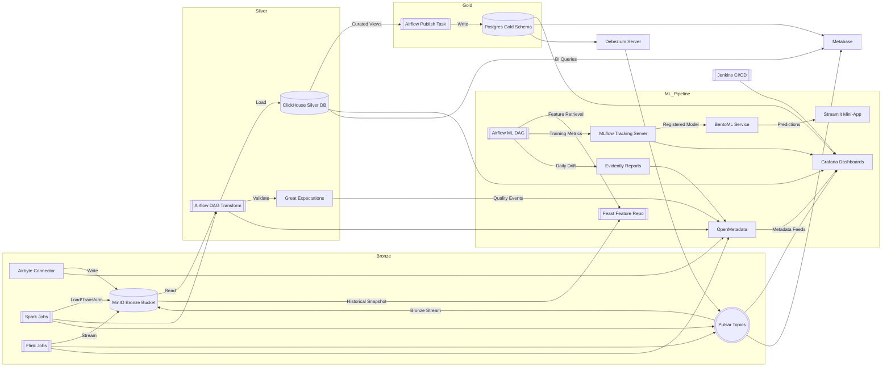

# OneRing Data Platform Architecture

## Overview
- **Purpose**: Local medallion-style data platform for demos and advisory engagements.
- **Paradigm**: Batch-first flows orchestrated via Airflow, with medallion layers stored across MinIO, ClickHouse, and Postgres.

## Core Components
1. **Airflow** orchestrates ingestion, validation, and transformations.
2. **Airbyte** enables self-service ingestion to Bronze (MinIO).
3. **Apache Pulsar** acts as the distributed messaging and streaming backbone.
4. **Debezium Server** streams logical changes from Postgres into Pulsar topics for downstream consumers.
5. **Apache Spark** provides distributed batch processing for ingestion and ML workloads.
6. **Apache Flink** powers streaming-oriented demos and CEP experiments.
7. **MinIO** stores data lake zones (Bronze/Silver/Gold), the restricted staging area, and the Iceberg warehouse with S3 compatibility.
8. **Great Expectations** validates data quality during DAG execution.
9. **Liquibase** versions schemas for Postgres and ClickHouse targets.
10. **OpenMetadata** centralizes catalog, lineage, and quality signals.
11. **Grafana** visualizes operational metrics and validation outcomes.
12. **Feast** manages feature views (file offline store + Redis online store).
13. **MLflow** tracks experiments, metrics, and registers Spark models (backed by Postgres + MinIO artifacts).
14. **BentoML** packages MLflow models for serving and exposes an HTTP endpoint.
15. **Evidently** runs scheduled drift reports through Airflow.
16. **Streamlit** offers an optional mini UI consuming the Bento endpoint.
17. **Trino** federates SQL across Iceberg tables in MinIO and curated Postgres datasets.
18. **Metabase** provides ad-hoc analytics on ClickHouse/Postgres (requires ClickHouse driver plugin).
19. **Jenkins** delivers CI/CD automation via JCasC-ready configuration.

## High-Level Flow

## Networking & Security
- Single Docker network `${PROJECT_NETWORK}` with service-specific subnets (defined in compose).
- Secrets managed locally via environment variables (`.env`); plug in your preferred vault if needed.

## Storage & Volumes
- Persistent named volumes for databases and message brokers.
- Bind mounts for configuration directories to ease iteration.
- Domain-driven workspace layout:
  - `platform/orchestration/airflow` – DAGs, config, plugins, and tests.
  - `platform/ingestion/airbyte` – connection templates and ingestion assets.
  - `platform/quality/great_expectations` – suites, checkpoints, runtime data.
  - `platform/catalog/openmetadata` – server and ingestion configs.
  - `platform/analytics/{clickhouse,dbt,trino}` – ClickHouse configs, dbt project, and Trino configuration.
  - `platform/analytics/metabase` – Metabase plugins (ClickHouse driver) and related assets.
  - `platform/storage/postgres/seeds` – Bootstrap SQL and seed data for the curated Postgres warehouse.
  - `platform/storage/medallion` – local Bronze/Silver/Gold samples.
  - `platform/security/keycloak` – realm exports and IAM configuration for Keycloak.
  - `platform/streaming/debezium` – Debezium Server configuration for CDC pipelines.
  - `platform/featurestore/feast_repo` – Feast project configuration and feature views.
  - `platform/ml/{training,bento_service}` – Spark ML pipeline code and Bento service assets.
  - `platform/versioning/liquibase` – changelogs and property files.
  - `platform/security/infisical` – vault configuration & onboarding scripts (`INFISICAL_*` settings).
  - `platform/observability/{grafana,prometheus}` – dashboards, scrape configs.
  - `ops/scripts` – bootstrap and operational automation.
