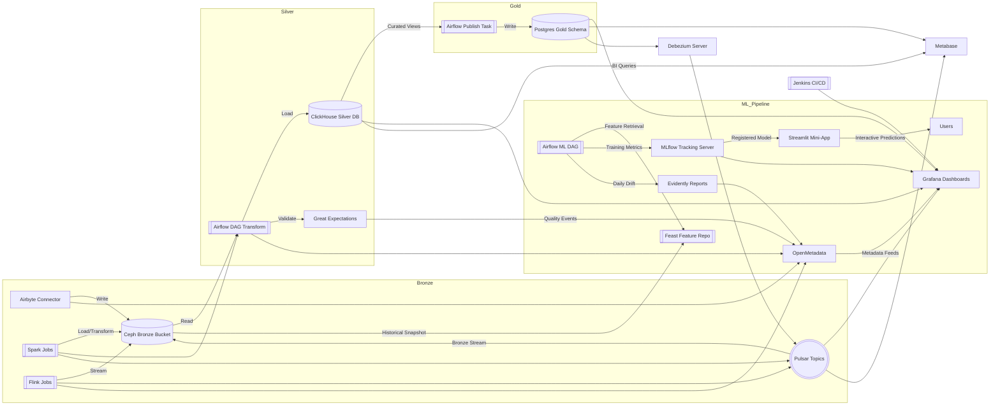

# OneRing Data Platform Architecture

## Overview
- **Purpose**: Local medallion-style data platform for demos and advisory engagements.
- **Paradigm**: Batch-first flows orchestrated via Airflow, with medallion layers stored across Ceph RGW, ClickHouse, and Postgres.

## Core Components
1. **Airflow** orchestrates ingestion, validation, and transformations.
2. **Airbyte** enables self-service ingestion to Bronze (Ceph RGW) so analysts and data consumers can register their own sources with minimal engineering support.
3. **Apache Pulsar** acts as the distributed messaging and streaming backbone.
4. **Debezium Server** streams logical changes from Postgres into Pulsar topics for downstream consumers, focusing solely on CDC feeds sourced from external/vendor systems.
5. **Apache Spark** provides distributed batch processing for ingestion and ML workloads, owned by the core data engineering team to productionize contractual/vendor feeds before they reach curated stores.
6. **Apache Flink** powers streaming-oriented demos and CEP experiments and serves as the primary stream-processing surface, consuming CDC topics or other events and writing either to Pulsar sinks or directly into the Bronze layer.
7. **Ceph RGW** stores data lake zones (Bronze/Silver/Gold), the restricted staging area, and the Iceberg warehouse with S3 compatibility.
8. **Great Expectations** validates data quality during DAG execution.
9. **Liquibase** versions schemas for Postgres and ClickHouse targets.
10. **OpenMetadata** centralizes catalog, lineage, and quality signals.
11. **Grafana** visualizes operational metrics and validation outcomes.
12. **Feast** manages feature views (file offline store + Redis online store).
13. **MLflow** tracks experiments, metrics, and registers Spark models (backed by Postgres + Ceph artifacts).
14. **Evidently** runs scheduled drift reports through Airflow.
15. **Streamlit** offers an optional mini UI that loads the latest registered MLflow model for scoring.
16. **Trino** federates SQL across Iceberg tables in Ceph RGW and curated Postgres datasets.
17. **Metabase** provides ad-hoc analytics on ClickHouse/Postgres (requires ClickHouse driver plugin).
18. **Jenkins** delivers CI/CD automation via JCasC-ready configuration.

## High-Level Flow

### Ingestion Responsibility Model
- **Self-service**: Airbyte workspaces expose Bronze landing zones so business units can hook up SaaS/operational sources without touching Spark code.
- **Core-engineered**: Spark jobs maintained under `platform/orchestration/airflow` and `platform/ml` handle contractual vendor deliveries and heavy ETL that need stricter SDLC controls.
- **Streaming-first**: Flink jobs are the default for real-time enrichment. They read Debezium CDC topics (or other Pulsar streams) and push enriched events back into Pulsar or, for persisted datasets, into Ceph's Bronze bucket.
- **CDC boundary**: Debezium stays focused on external Postgres sources so that change data capture happens before Flink fans the data out to the rest of the platform.

### Analytics Responsibility Model
- **Spark + Iceberg**: Spark orchestrations apply the medallion pattern over Iceberg tables stored in Ceph RGW, producing high-quality zones that power ML/Feast pipelines.
- **dbt + ClickHouse**: SQL-first transformations live in dbt and publish `staging`/`marts` schemas directly inside ClickHouse, the analyst-facing warehouse exposed to Metabase/Trino.
- **Postgres**: Reserved for transactional workloads, Airflow metadata, and CDC/streaming pipelines (Debezium/Flink). It is no longer a reporting surface for analysts.

### Identity Gatekeeping
- **Keycloak**: Central IAM provider delivering realm roles, OIDC clients, and LDAP federation. It acts as the authority for every web UI and service token.
- **oauth2-proxy**: Each end-user interface (Airflow, Airbyte, MLflow, Metabase) is fronted by an oauth2-proxy instance configured against the Keycloak realm. Users authenticate once in Keycloak; the proxy places vetted headers/cookies in front of the upstream service so the workload never handles credentials directly.
- **Programmatic access**: Trino, automation scripts, and CLI workflows can use Keycloak-issued client credentials or service accounts. Combine OAuth tokens with the existing RBAC model (realm roles/groups) to centralize access decisions.

## Networking & Security
- Single Docker network `${PROJECT_NETWORK}` with service-specific subnets (defined in compose).
- Secrets managed locally via environment variables (`.env`); plug in your preferred vault if needed.

## Storage & Volumes
- Persistent named volumes for databases and message brokers.
- Bind mounts for configuration directories to ease iteration.
- Domain-driven workspace layout:
  - `platform/orchestration/airflow` – DAGs, config, plugins, and tests.
  - `platform/ingestion/airbyte` – connection templates and ingestion assets.
  - `platform/quality/great_expectations` – suites, checkpoints, runtime data.
  - `platform/catalog/openmetadata` – server and ingestion configs.
  - `platform/analytics/{clickhouse,dbt,trino}` – ClickHouse configs, dbt project, and Trino configuration.
  - `platform/analytics/metabase` – Metabase plugins (ClickHouse driver) and related assets.
  - `platform/storage/postgres/seeds` – Bootstrap SQL and seed data for the curated Postgres warehouse.
  - `platform/storage/medallion` – local Bronze/Silver/Gold samples.
  - `platform/security/keycloak` – realm exports and IAM configuration for Keycloak.
  - `platform/security/ldap` – bootstrap LDIF for the shared OpenLDAP directory.
  - `platform/streaming/debezium` – Debezium Server configuration for CDC pipelines.
  - `platform/featurestore/feast_repo` – Feast project configuration and feature views.
  - `platform/ml/{training,mlflow}` – Spark ML pipeline code and MLflow server assets.
  - `platform/versioning/liquibase` – changelogs and property files.
  - `platform/security/infisical` – vault configuration & onboarding scripts (`INFISICAL_*` settings).
  - `platform/observability/{grafana,prometheus}` – dashboards, scrape configs.
  - `ops/scripts` – bootstrap and operational automation.
