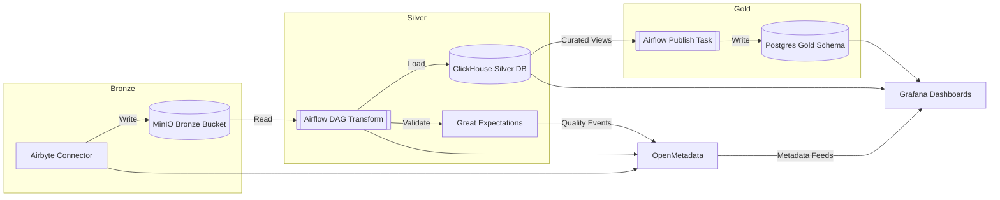

# OneRing Data Platform Architecture

## Overview
- **Purpose**: Local medallion-style data platform for demos and advisory engagements.
- **Paradigm**: Batch-first flows orchestrated via Airflow, with medallion layers stored across MinIO, ClickHouse, and Postgres.

## Core Components
1. **Airflow** orchestrates ingestion, validation, and transformations.
2. **Airbyte** enables self-service ingestion to Bronze (MinIO).
3. **MinIO** stores data lake zones (Bronze/Silver/Gold) with S3 compatibility.
4. **Great Expectations** validates data quality during DAG execution.
5. **Liquibase** versions schemas for Postgres and ClickHouse targets.
6. **OpenMetadata** centralizes catalog, lineage, and quality signals.
7. **Grafana** visualizes operational metrics and validation outcomes.

## High-Level Flow

## Networking & Security
- Single Docker network `${PROJECT_NETWORK}` with service-specific subnets (defined in compose).
- Secrets managed locally via environment variables (`.env`); plug in your preferred vault if needed.

## Storage & Volumes
- Persistent named volumes for databases and message brokers.
- Bind mounts for configuration directories to ease iteration.
- Domain-driven workspace layout:
  - `platform/orchestration/airflow` – DAGs, config, plugins, and tests.
  - `platform/ingestion/airbyte` – connection templates and ingestion assets.
  - `platform/quality/great_expectations` – suites, checkpoints, runtime data.
  - `platform/catalog/openmetadata` – server and ingestion configs.
  - `platform/analytics/{clickhouse,postgres}` – DDL, init SQL, curated seeds.
  - `platform/storage/medallion` – local Bronze/Silver/Gold samples.
  - `platform/versioning/liquibase` – changelogs and property files.
  - `platform/security/infisical` – vault configuration & onboarding scripts (`INFISICAL_*` settings).
  - `platform/observability/{grafana,prometheus}` – dashboards, scrape configs.
  - `ops/scripts` – bootstrap and operational automation.
